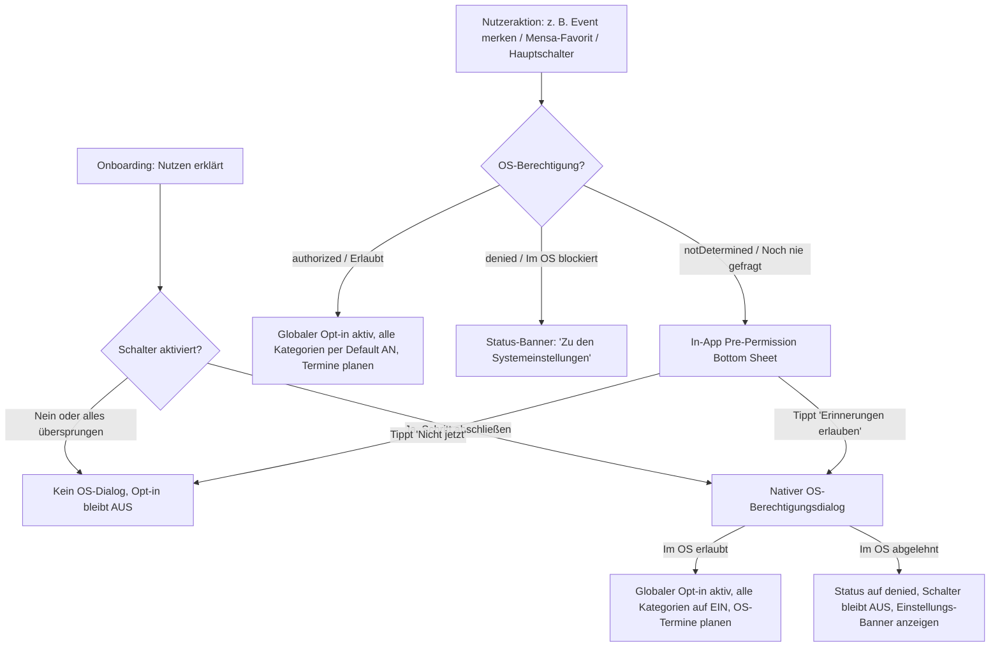

# UX- und Content-Spezifikation: Lokale Benachrichtigungen

**Campus Köthen App** · `AGPL-3.0-only` · Copyright © 2026 Leviora Studio and Jona Loreen Sommer  
**Autorin:** Mira (UX- / Product-Design) · **Stand:** 24.08.2026 · **Status:** Verbindliche Spezifikation (Freigegeben nach [LEVIORA-159](mention://issue/5e3e877a-f4ee-484a-8d71-0bdfa4c088a4)) · **Basis:** [ADR-0001](../adr/0001-push-benachrichtigungen.md)

---

## 1. Kontext, Ziel und Funktionsweise lokaler Benachrichtigungen

### 1.1 Kontext und Architektur-Entscheidung

Gemäß der verbindlichen Produktentscheidung ([LEVIORA-159](mention://issue/5e3e877a-f4ee-484a-8d71-0bdfa4c088a4)) und [ADR-0001](../adr/0001-push-benachrichtigungen.md) nutzt die Campus Köthen App **ausschließlich geräteseitig vorausgeplante lokale Benachrichtigungen** (`flutter_local_notifications`).

- **Kein Push-Server & kein Drittanbieter**: Es gibt keine Anbindung an Firebase Cloud Messaging (FCM), Apple Push Notification service (APNs-Server) oder externe Relays.
- **Keine Hintergrundaktualisierung (S1)**: Die App führt im Hintergrund bei geschlossener App keinen Netzwerkcode aus (kein WorkManager / BGTaskScheduler).
- **Datengrundlage**: Ausschließlich Daten, die beim letzten App-Lauf bereits lokal im Cache bzw. in verschlüsselten Boxen vorliegen (gemerkte Events, Stundenplan, öffentliche Kalender, Moodle-Deadlines, 14-Tage-Speiseplan).
- **Vollständige Privatsphäre**: Keine Gerätekennung, keine Registrierung, keine Übertragung von Vorlieben, Favoriten oder Zugangsdaten an ein Backend.

### 1.2 Wie die lokale Vorausplanung funktioniert

1. Die App berechnet beim Start, nach jedem erfolgreichen Datenabruf oder bei Einstellungsänderungen über eine zustandslose Planungsfunktion (`NotificationPlanner`) alle anstehenden Termine innerhalb des Planungshorizonts.
2. Diese Termine werden beim Betriebssystem für künftige Zeitpunkte registriert (`NotificationScheduler`).
3. Das Betriebssystem (Android / iOS) stellt die Benachrichtigungen zum geplanten Zeitpunkt zu – auch wenn die App beendet ist und das Smartphone offline ist.

```text
+-----------------------------------------------------------------------------------+
| ERLAUBT & ZUVERLÄSSIG MÖGLICH                    | SYSTEMGRENZE (BEWUSSTER VERZICHT)|
| (Datiert & beim letzten Abruf bekannt)           | (Erst nach App-Schließen neu)    |
+--------------------------------------------------+----------------------------------+
| - Relevante Events (gemerkt & aus aktivierten    | - Neue redaktionelle Beiträge    |
|   Kalendern): genau 1 Hinweis 24h vorher         |   und Events, die erst nach dem  |
| - Morgendliche Tagesübersicht um 08:00 Uhr       |   letzten App-Lauf entstanden    |
|   (Mensa, Events, Vorlesungen, Moodle-Fristen)   | - Kurzfristige Ausfälle am Morgen|
| - Favorisiertes Mensaessen um 11:00 Uhr          |   die erst nach dem letzten      |
| - Aktualisierung / Löschung ausstehender         |   Datenabruf eingetragen wurden  |
|   Hinweise bei lokal bekannten Änderungen        | - Neue E-Mails / neue Noten      |
+-----------------------------------------------------------------------------------+
```

### 1.3 Transparenz über den Planungshorizont & Aktualitätsgrenze (UX-Prinzip)

Nutzerinnen und Nutzer müssen die Funktionsweise verstehen: Die Benachrichtigungen spiegeln den zuletzt lokal bekannten Datenstand wider.

- **Keine Echtzeitgarantie ohne erneuten App-Abruf**: Kurzfristige Änderungen auf externen Servern (z. B. spontaner Vorlesungsausfall am frühen Morgen) sind der App erst nach dem nächsten Öffnen bekannt.
- **Aktualisierung und Bereinigung**: Lokal bekannt gewordene Änderungen oder Löschungen aktualisieren bzw. entfernen ausstehende Hinweise sofort.
- **Keine Geister-Erinnerungen**: Abgelaufene Einträge oder Termine aus der Vergangenheit erzeugen keine nachträglichen Benachrichtigungen.
- **Planungsvorrat**: Wird die App über mehrere Wochen nicht geöffnet, läuft der vorausgeplante Vorrat (z. B. 14 Tage Speiseplan) aus. In den Einstellungen wird dies verständlich und ohne technischen Jargon erklärt.

---

## 2. Opt-in-Flow und Permission-Architektur

### 2.1 System-Prompt erst nach erklärtem Nutzen

Die App zeigt den nativen Systemdialog (`POST_NOTIFICATIONS` unter Android 13+ bzw. `UNUserNotificationCenter` unter iOS) nie unvermittelt beim Öffnen. Im letzten Onboarding-Schritt erklärt sie zuerst die drei lokalen Benachrichtigungsarten. Der Schalter „Benachrichtigungen aktivieren“ ist standardmäßig eingeschaltet; erst beim bewussten Abschluss des Schritts folgt der Systemdialog. Wird der Schalter ausgeschaltet oder das Onboarding vollständig übersprungen, erscheint kein Systemdialog. Außerhalb des Onboardings übernimmt weiterhin das Pre-Permission Sheet diese Erklärung. Ein im OS einmal verweigerter Status kann nicht erneut direkt aus der App abgefragt werden.

### 2.2 Kontextuelle Einstiegspunkte (Trigger Points)

Die Berechtigungsabfrage wird erst gestartet, wenn Nutzende ein klares Interesse an einer datierten Funktion signalisieren:

| Einstiegspunkt            | Auslöser / Nutzeraktion                                                | Kontextueller Nutzen im Pre-Permission Sheet                                             |
| :------------------------ | :--------------------------------------------------------------------- | :--------------------------------------------------------------------------------------- |
| **A. Event merken**       | Nutzer tippt in `/news/events` oder `/calendar` auf „Event merken“     | „Erhalte exakt 24 Stunden vor Beginn deiner gemerkten Events eine Erinnerung.“           |
| **B. Mensa-Favorit**      | Nutzer favorisiert in `/canteen` ein Gericht (Stern-Symbol)            | „Lass dich um 11:00 Uhr erinnern, wenn dein Lieblingsgericht auf dem Speiseplan steht.“  |
| **C. Stundenplan-Gruppe** | Nutzer wählt in `/calendar` erstmals seine Seminargruppe               | „Erhalte deine Tagesübersicht um 08:00 Uhr mit allen Vorlesungen und Terminen.“          |
| **D. Moodle-Anmeldung**   | Nutzer verknüpft Moodle in `/more/moodle`                              | „Lass dich in der morgendlichen Tagesübersicht an anstehende Fristen erinnern.“          |
| **E. Onboarding**         | Abschluss des letzten Onboarding-Schritts bei eingeschaltetem Schalter | Erklärung aller drei Kategorien im Schritt; anschließend direkt der native Systemdialog. |
| **F. Einstellungen**      | Nutzer öffnet `/more/settings/notifications`                           | Globaler Hauptschalter zur Aktivierung aller lokalen Benachrichtigungen.                 |



### 2.3 Pre-Permission Bottom Sheet (In-App)

Bereitet den nativen Systemdialog transparent vor. Folgt dem Design-System (`24 dp` Eckenradius, Albert Sans, Tabler Icons, `48 dp` Touch Targets).

#### Visuelle Anatomie & Inhalte

- **Icon**: `IconBellCheck` in Beere (`#C2185B` Light / `#EC6E9F` Dark), Container `48x48 dp` (`#FBE4EE` / `#511F37`).
- **Titel**: 20/24, Gewicht 800: `Lokale Benachrichtigungen aktivieren?` (EN: `Enable local notifications?`)
- **Fließtext**: 14/20, Gewicht 400:
  - _DE_: `Erhalte morgens um 08:00 Uhr deine Tagesübersicht mit Vorlesungen, Terminen, Fristen und Mensa sowie rechtzeitige Hinweise zu gemerkten Events (24 Stunden vorher) und Mensa-Favoriten (11:00 Uhr). Alle Benachrichtigungen werden rein lokal auf deinem Smartphone geplant – ohne Tracking, ohne Server und ohne Nutzerkonto.`
  - _EN_: `Get your daily overview at 8:00 AM with lectures, events, deadlines, and canteen menus, plus timely reminders for saved events (24 hours prior) and canteen favourites (11:00 AM). All notifications are scheduled purely on your device – no tracking, no servers, no user account.`
- **Privacy-Note**: 12/16, Gewicht 600 mit `IconShieldCheck` (Größe 16):
  - _DE_: `100 % geräteseitig: Deine Daten und Einstellungen verlassen niemals dein Smartphone.`
  - _EN_: `100% on-device: Your preferences and data never leave your phone.`
- **Primär-Button**: `Erinnerungen erlauben` (EN: `Allow reminders`) — Öffnet den OS-Dialog.
- **Sekundär-Button**: `Nicht jetzt` (EN: `Not now`) — Schließt Sheet ohne OS-Aufruf.

---

## 3. Einstellungsansicht (`/more/settings/notifications`)

### 3.1 Screen-Aufbau & Informationsarchitektur

Die Benachrichtigungseinstellungen liegen unter _Mehr → Einstellungen → Benachrichtigungen_.

- **Route**: `/more/settings/notifications`
- **Header**: Eyebrow `EINSTELLUNGEN`, Titel `Benachrichtigungen`
- **Standardeinstellung (Defaults)**: Nach dem globalen Opt-in sind **alle Kategorien standardmäßig aktiviert** (LEVIORA-159). Ohne OS-Berechtigung erfolgt keine Zustellung.

```text
+-------------------------------------------------------------+
|  <- EINSTELLUNGEN                                           |
|  Benachrichtigungen                                         |
+-------------------------------------------------------------+
|  [!] SYSTEMBERECHTIGUNG (nur sichtbar, wenn im OS gesperrt) |
|      Mitteilungen sind im Betriebssystem deaktiviert.       |
|      [ Zu den Systemeinstellungen ]                         |
+-------------------------------------------------------------+
|  HAUPTSCHALTER                                              |
|  Benachrichtigungen aktivieren                       [ ON ] |
|  Lokale Erinnerungen auf diesem Gerät empfangen             |
+-------------------------------------------------------------+
|  THEMEN & KATEGORIEN (Standardmäßig alle aktiviert)         |
|                                                             |
|  Morgendliche Tagesübersicht                         [ ON ] |
|  Täglich um 08:00 Uhr: Vorlesungen, relevante Events,       |
|  Moodle-Abgabefristen und Speiseplan                        |
|                                                             |
|  Gemerkte & öffentliche Events                       [ ON ] |
|  Genau eine Erinnerung 24h vor Beginn                       |
|  (Zustellfenster: 07:00–20:00 Uhr)                          |
|                                                             |
|  Favorisierte Mensagerichte                          [ ON ] |
|  Einzelhinweis um 11:00 Uhr am Angebotstag                  |
|                                                             |
|  HINWEIS ZU STUNDENPLAN & MOODLE                            |
|  Lehrveranstaltungen und Moodle-Fristen fließen in die      |
|  Tagesübersicht um 08:00 Uhr ein und erzeugen keine         |
|  zusätzlichen Einzelerinnerungen.                           |
+-------------------------------------------------------------+
|  HINWEIS ZUR AKTUALITÄT                                     |
|  (i) Erinnerungen basieren auf dem letzten Stand der App.   |
|      Öffne die App regelmäßig, um Termine und Speisepläne   |
|      aktuell zu halten. Spontane Änderungen bei             |
|      geschlossener App können nicht gemeldet werden.        |
+-------------------------------------------------------------+
```

### 3.2 Systemberechtigungs-Banner & OS-Zustände

- **Erlaubt (`authorized`)**: Kein Banner; Hauptschalter und Unterkategorien interaktiv und aktiv.
- **Im OS deaktiviert / abgelehnt (`denied` / `revoked`)**:
  - Permanentes Hinweis-Banner im `Fehler`/`Primär-Container`-Stil.
  - _Text DE_: `Mitteilungen sind in den Android-/iOS-Systemeinstellungen deaktiviert.`
  - _Aktion_: Button `Zu den Systemeinstellungen` (`openAppSettings()`).
  - Alle Unterkategorien werden deaktiviert dargestellt (`disabled`), da ohne OS-Berechtigung keine Zustellung möglich ist.
- **Android Notification Channel stummgeschaltet**:
  - Betroffene Kategorie zeigt Hinweis: `In Android-Einstellungen stummgeschaltet.` mit Direktlink zum Kanal.

---

## 4. Fachliche Kategorien und Frequenzregeln (Katalog)

### 4.1 Detailmatrix nach LEVIORA-159

| #         | Kategorie-ID & Name (DE / EN)                                                              | Fachlicher Umfang                                                                        | Quelle & Trigger                                                         | Vorlauf & Zustellzeitpunkt                                                            | Bündelung & Frequenz                                                                  | Default (nach Opt-in) |
| :-------- | :----------------------------------------------------------------------------------------- | :--------------------------------------------------------------------------------------- | :----------------------------------------------------------------------- | :------------------------------------------------------------------------------------ | :------------------------------------------------------------------------------------ | :-------------------- |
| **K7**    | `daily_summary`<br>**Morgendliche Tagesübersicht**<br>_Daily Morning Summary_              | **Hoch**: Zusammenfassung aller relevanten Termine des Tages auf einen Blick.            | Aggregierter lokaler Tagesbestand (Kalender, Vorlesungen, Moodle, Mensa) | **Morgens um 08:00 Uhr** (täglich)                                                    | **Genau 1 Nachricht pro Tag**. Fasst Mensa, Events, Stundenplan und Fristen zusammen. | **EIN**               |
| **K1/K2** | `events_reminder`<br>**Gemerkte & öffentliche Events**<br>_Saved & Public Calendar Events_ | **Sehr hoch**: Pünktliche Erinnerung an selbst gemerkte Termine und aktivierte Kalender. | `campus_saved_events_v1` + lokaler Kalender-Cache aktivierter Kalender   | **Exakt 24 Stunden vorher**.<br>Zustellfenster: **07:00–20:00 Uhr** (sonst 07:00 Uhr) | **Genau 1 Nachricht je Event**. Gleichzeitig fällige Hinweise bleiben getrennt.       | **EIN**               |
| **K5**    | `canteen_favourites`<br>**Favorisierte Mensagerichte**<br>_Canteen Meal Favourites_        | **Hoch**: Informiert gezielt, wenn Lieblingsgerichte auf dem Speiseplan stehen.          | Lokaler Speiseplan-Cache (14 Tage) + `canteen.favourites.v1`             | **Vormittags um 11:00 Uhr** am Angebotstag                                            | **Genau 1 Nachricht um 11:00 Uhr**. Zusätzlicher Einzelhinweis zur Tagesübersicht.    | **EIN**               |
| **K3**    | `timetable_lectures`<br>**Lehrveranstaltungen & Stundenplan**<br>_Timetable & Lectures_    | **Bestandteil K7**: Geplante Vorlesungen & bekannte Änderungen.                          | Lokaler Stundenplan-Cache der gewählten Gruppe                           | Fließt in die Tagesübersicht um **08:00 Uhr** ein.                                    | **Keine zusätzlichen Einzelerinnerungen**.                                            | **EIN** (in K7)       |
| **K6**    | `moodle_deadlines`<br>**Moodle-Abgabefristen**<br>_Moodle Submission Deadlines_            | **Bestandteil K7**: Diskreter Schutz vor verpassten Abgabefristen.                       | Verschlüsselte lokale Moodle-Box (`dueAt`)                               | Fließt in die Tagesübersicht um **08:00 Uhr** ein.                                    | **Keine zusätzlichen Einzelerinnerungen**.                                            | **EIN** (in K7)       |

### 4.2 Frequenz-, Zeitfenster- und Bündelungsregeln

1. **Exakte 24-Stunden-Regel mit Zustellfenster (07:00–20:00 Uhr)**:
   - Ein relevantes Event löst genau eine Erinnerung exakt 24 Stunden vor Veranstaltungsbeginn aus.
   - Liegt dieser 24-Stunden-Zeitpunkt außerhalb des Zeitfensters von **07:00 bis 20:00 Uhr** (z. B. bei einem Event, das um 08:00 Uhr morgens beginnt, wäre 24h vorher 08:00 Uhr am Vortag = im Fenster; bei einem frühen Event oder besonderen Zeiten außerhalb 07:00–20:00 Uhr), erfolgt die Zustellung stattdessen zum **nächstmöglichen Zeitpunkt um 07:00 Uhr**.
2. **Feste Zeitpunkte für Tagesübersicht und Mensa**:
   - Die Tagesübersicht erscheint verlässlich um **08:00 Uhr**.
   - Der Mensa-Favoritenhinweis erscheint verlässlich um **11:00 Uhr**.
3. **Keine Bündelung gleichzeitig fälliger Hinweise**:
   - Fallen mehrere Hinweise auf denselben Auslösezeitpunkt (z. B. zwei Event-Erinnerungen oder Mensa-Hinweis und Event-Erinnerung), werden diese **nicht in eine Sammelbenachrichtigung zusammengefasst**, sondern als **separate, eigenständige Benachrichtigungen** zugestellt.
4. **Keine Einzelerinnerungen für Lehrveranstaltungen und Moodle**:
   - Zur Vermeidung von Benachrichtigungsüberflutung (Spam) erzeugen einzelne 90-Minuten-Vorlesungsblöcke und Moodle-Fristen keine separaten Einzelhinweise, sondern werden vollständig und übersichtlich in der Tagesübersicht um 08:00 Uhr abgebildet.
5. **Budget-Deckelung**:
   - Maximal **60 geplante Benachrichtigungen** gleichzeitig im Betriebssystem (Einhaltung des iOS-Limits von 64). Bei Überschreitung priorisiert der Planer die zeitlich nächsten Termine; nachfolgende Termine rücken bei jedem App-Aufruf nach.

---

## 5. Datenschutz auf dem Sperrbildschirm und Content-Spezifikation

### 5.1 Datenschutzregeln für Sperrbildschirminhalte

1. **Öffentliche Termindetails**: Öffentliche Events (z. B. Campusfest, Vorträge) und Mensagerichte dürfen auf dem Sperrbildschirm **vollständig mit Name, Zeit und Ort** angezeigt werden.
2. **Neutrale persönliche Inhalte**: Inhalte mit persönlichen Daten (z. B. Moodle-Aufgaben, vertrauliche Studienfristen, Noten oder E-Mail-Referenzen) bleiben **vor dem Entsperren neutral**.
   - _Moodle ist hierfür die Referenz_: Auf dem Sperrbildschirm erscheint nur der neutrale Hinweis auf eine anstehende Frist ohne Kurs- oder Aufgabennamen.
   - Die vollständigen Details (Kursname, genauer Aufgabentitel) sind erst nach dem Entsperren innerhalb der App sichtbar.
3. **Präzise Kürze**: Benachrichtigungstexte sind für eine optimale Lesbarkeit auf Standard-Displays auf maximal zwei Zeilen optimiert.

### 5.2 Lokalisierte Beispieltexte (DE / EN)

```json
{
  "daily_summary": {
    "de": {
      "title": "Guten Morgen! Dein Tag am Campus",
      "body": "Heute 3 Vorlesungen (erste um 08:30 Uhr), Moodle-Abgabe »Übungsblatt 4« bis 23:59 Uhr und Käsespätzle in der Mensa."
    },
    "en": {
      "title": "Good morning! Your campus day",
      "body": "3 lectures today (first at 8:30 AM), Moodle deadline »Assignment 4« until 11:59 PM, and Cheese Spaetzle in the canteen."
    },
    "neutral_lockscreen_de": {
      "title": "Guten Morgen! Dein Tag am Campus",
      "body": "Heute 3 Vorlesungen, 1 Moodle-Abgabefrist und Speiseplan verfügbar."
    },
    "neutral_lockscreen_en": {
      "title": "Good morning! Your campus day",
      "body": "3 lectures today, 1 Moodle submission deadline, and canteen menu available."
    }
  },
  "events_reminder": {
    "de": {
      "title": "Erinnerung morgen: Campus Sommerfest 2026",
      "body": "Morgen um 16:00 Uhr auf der Campuswiese."
    },
    "en": {
      "title": "Reminder tomorrow: Campus Summer Festival 2026",
      "body": "Tomorrow at 4:00 PM on the campus lawn."
    },
    "fallback_window_de": {
      "title": "Erinnerung heute: Vortrag Künstliche Intelligenz",
      "body": "Heute um 08:00 Uhr im Hörsaal 01."
    },
    "fallback_window_en": {
      "title": "Reminder today: Lecture Artificial Intelligence",
      "body": "Today at 8:00 AM in Lecture Hall 01."
    }
  },
  "canteen_favourites": {
    "de": {
      "title": "Heute dein Lieblingsgericht in der Mensa",
      "body": "In der Mensa Fasanerieallee gibt es heute »Käsespätzle mit Röstzwiebeln« (2,80 €)."
    },
    "en": {
      "title": "Your favourite meal at the canteen today",
      "body": "Mensa Fasanerieallee serves »Cheese Spaetzle with roasted onions« today (€2.80)."
    }
  },
  "moodle_deadlines_neutral": {
    "de": {
      "title": "Moodle: Abgabefrist heute",
      "body": "Eine deiner Aufgaben ist heute fällig. Tippe hier für Details."
    },
    "en": {
      "title": "Moodle: Submission deadline today",
      "body": "An assignment is due today. Tap for details."
    }
  }
}
```

---

## 6. Tap-Routing und fehlertolerante Fallbacks

### 6.1 Routing-Tabelle auf `AppRoutes`

Ein Tap auf eine Benachrichtigung führt direkt zum betroffenen Inhalt:

| Benachrichtigungs-Typ | Lokaler Typ-Identifier | Ziel-Route in `AppRoutes`                   | Konkretes Verhalten beim Öffnen                         |
| :-------------------- | :--------------------- | :------------------------------------------ | :------------------------------------------------------ |
| `daily_summary`       | `daily.summary`        | `AppRoutes.calendar` (`/calendar`)          | **Öffnet direkt die Tagesansicht** des aktuellen Tages. |
| `events_reminder`     | `event.reminder`       | `AppRoutes.newsEventsName` (`/news/events`) | **Öffnet direkt das Event** und fokussiert Details.     |
| `canteen_favourites`  | `canteen.favourite`    | `AppRoutes.canteen` (`/canteen`)            | **Öffnet direkt das Mensagericht** im Speiseplan.       |

### 6.2 Fehler- und Fallback-Verhalten

- **Eintrag lokal gelöscht / nicht mehr vorhanden**:
  - Die App navigiert zum übergeordneten Root-Tab (`/calendar`, `/canteen` oder `/news/events`).
  - Eine dezente SnackBar informiert: _„Der aufgerufene Eintrag ist nicht mehr vorhanden.“_ (Kein Absturz, kein Hängenbleiben).
- **Offline / Kein Netz beim Tap**:
  - Lokale Daten werden sofort aus dem Cache gerendert.
- **Kaltstart (App war vollständig beendet)**:
  - `GoRouter` initialisiert die `AppShell` und navigiert deterministisch auf das direkte Ziel.

---

## 7. Zustandsmatrix der lokalen Planung (State Machine)

| #      | System-Zustand                                            | Hauptschalter / Kategorie | Planer-Verhalten                                   | UI-Anzeige in `/more/settings/notifications`                                      |
| :----- | :-------------------------------------------------------- | :------------------------ | :------------------------------------------------- | :-------------------------------------------------------------------------------- |
| **1**  | **Erststart / Nie gefragt** (`notDetermined`)             | `false`                   | Keine Termine beim OS geplant                      | Hauptschalter AUS. Öffnet bei Betätigung das Pre-Permission Sheet.                |
| **2**  | **Pre-Permission aktiv**                                  | `false`                   | Keine Termine                                      | In-App Bottom Sheet wird angezeigt.                                               |
| **3**  | **Im OS erlaubt** (`authorized`)                          | `true` (alle Kat. `true`) | Bis zu 60 Termine beim OS registriert              | Hauptschalter AN, alle Kategorien AN. Voll funktionsfähig.                        |
| **4**  | **Im OS abgelehnt** (`denied`)                            | `false`                   | Alle Termine im OS gelöscht (`cancelAll()`)        | Hauptschalter AUS. Rotes Banner mit Button `Zu den Systemeinstellungen`.          |
| **5**  | **Im OS nachträglich entzogen**                           | `true` (gemerkt)          | Keine Zustellung durch OS möglich                  | Automatische Erkennung bei `resumed`: Warnbanner aktiv, Schalter ausgegraut.      |
| **6**  | **Android-Kanal stummgeschaltet**                         | `true`                    | Kanal-spezifische Stummschaltung                   | Hinweis an Kategorie: `In Android stummgeschaltet.`                               |
| **7**  | **Quelldaten fehlen / leer** (z. B. Semesterferien)       | `true`                    | Planer läuft leer (0 geplante Einträge)            | Kategorien bleiben aktiv, Hinweis: `Aktuell keine anstehenden Termine vorhanden.` |
| **8**  | **Lokal bekannte Änderung / Löschung**                    | `true`                    | Sofortiges `cancelAll()` & vollständige Neuplanung | Geänderte Zeiten übernommen, gelöschte Einträge restlos entfernt.                 |
| **9**  | **Abgelaufene Termine**                                   | `true`                    | Vergangene Zeitpunkte werden ignoriert             | Keine nachträgliche Benachrichtigung für vergangene Termine.                      |
| **10** | **Planungshorizont erschöpft** (App lange nicht geöffnet) | `true`                    | Alle früheren Termine abgelaufen                   | Ruhiger Zustand; bei nächstem App-Start wird automatisch neu geplant.             |
| **11** | **Recovery (Rückkehr aus OS-Einstellungen)**              | `true`                    | Sofortige Neuplanung aller Termine                 | Bei `AppLifecycleState.resumed` verschwindet das Banner; automatische Planung.    |
| **12** | **Daten-Reset / App zurücksetzen**                        | `false`                   | `cancelAll()` löscht alle OS-Termine               | Alle Präferenzen und Alarme restlos entfernt.                                     |

---

## 8. Barrierefreiheit (a11y) und Plattformkonventionen

### 8.1 Screenreader-Unterstützung (VoiceOver & TalkBack)

- **Switches**: Eindeutige semantische Labels und Zustände:
  - `Semantics(label: "Morgendliche Tagesübersicht", value: "Aktiviert", hint: "Doppeltippen zum Ausschalten")`
- **Status-Banner**: Deklariert als `LiveRegion`, damit Berechtigungsänderungen nach Rückkehr aus den OS-Einstellungen sofort barrierefrei angesagt werden.
- **Fokus-Management**: Beim Öffnen von Dialogen und Sheets liegt der initiale Fokus auf der Überschrift.

### 8.2 Touch-Ziele, Kontraste & Reduzierte Bewegung

- **Touch Targets**: Durchgehend mindestens `48x48 dp`.
- **Kontraste**: Bedienelement-Grenzen (inaktive Switches, Konturen) erfüllen min. `3:1` gegen den Hintergrund; Fließtext erfüllt `> 7:1`.
- **Reduced Motion**: Wenn im OS `prefers-reduced-motion` aktiv ist, öffnen sich Bottom Sheets ohne Rutsch-Animation (`FadeTransition`).

### 8.3 Plattformspezifika (Android vs. iOS)

- **Android**:
  - Anlegen dedizierter Notification Channels (`summary_channel`, `events_channel`, `canteen_channel`).
  - Planung mit `zonedSchedule` und `inexactAllowWhileIdle` (benötigt **keine** `SCHEDULE_EXACT_ALARM`-Berechtigung).
  - Monochromes Small Icon für Statusleiste.
- **iOS**:
  - Nutzung des `UNUserNotificationCenter` für lokale Trigger (`UNCalendarNotificationTrigger`).
  - Keine Push-Entitlements oder Background Modes im Xcode-Projekt erforderlich.

---

## 9. Zusammenfassung der verbindlichen Vorgaben (nach LEVIORA-159)

| Regel-Bereich                       | Verbindliche Festlegung                                                                                         |
| :---------------------------------- | :-------------------------------------------------------------------------------------------------------------- |
| **Architektur**                     | Rein lokale Vorausplanung (S1), keine Hintergrundaktualisierung, kein Push-Server.                              |
| **Kategorie-Defaults**              | **Alle Kategorien standardmäßig aktiviert (EIN)** nach globalem Opt-in.                                         |
| **Tagesübersicht (K7)**             | **08:00 Uhr morgens**; umfasst Vorlesungen, Moodle-Abgabefristen, relevante Events und Mensa.                   |
| **Stundenplan (K3) & Moodle (K6)**  | **Keine separaten Einzelerinnerungen**; fließen vollständig in die Tagesübersicht (08:00 Uhr) ein.              |
| **Events (K1/K2)**                  | **Genau 1 Erinnerung exakt 24 Stunden vorher**; Zustellfenster **07:00–20:00 Uhr** (sonst 07:00 Uhr).           |
| **Mensa-Favorit (K5)**              | **Genau 1 Einzelhinweis um 11:00 Uhr** am Tag des Angebots.                                                     |
| **Bündelung gleichzeitig fälliger** | **Keine Bündelung**; gleichzeitig fällige Hinweise werden als separate Benachrichtigungen zugestellt.           |
| **Sperrbildschirm-Datenschutz**     | Öffentliche Events/Mensa vollständig sichtbar; **persönliche Inhalte (Moodle) bleiben vor Entsperren neutral**. |
| **Tap-Ziele**                       | Direkter Sprung zum Inhalt (Event, Gericht); Tagesübersicht öffnet die **Tagesansicht** (`/calendar`).          |
| **Aktualisierung / Löschung**       | Lokal bekannte Änderungen/Löschungen aktualisieren/entfernen Alarme; keine verspäteten Alt-Hinweise.            |
